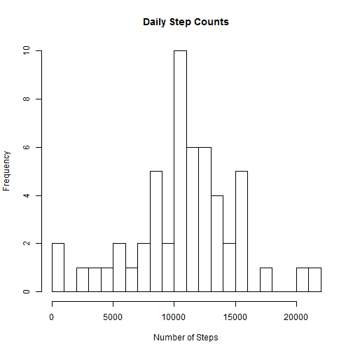
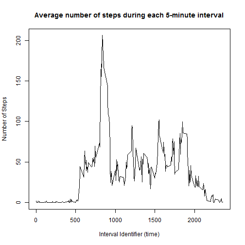
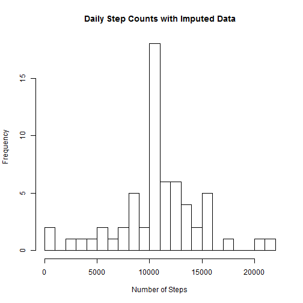
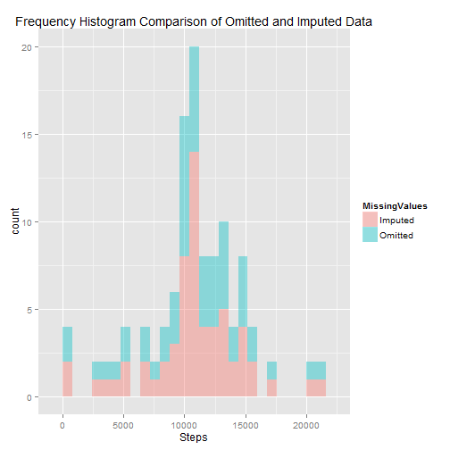
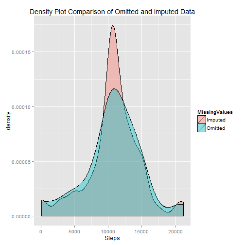
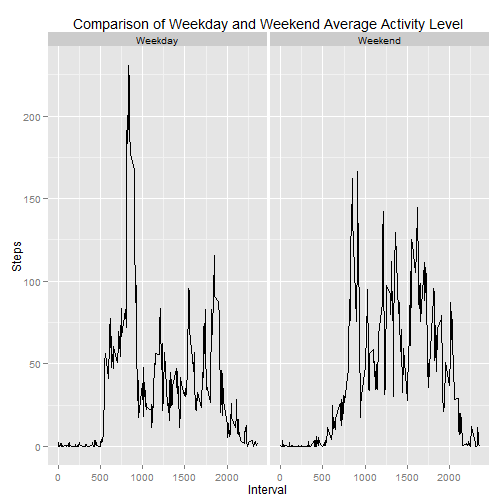

Activity Analysis
========================================================

Required libraries include  knitr, ggplot2.  Working directory must be set to location of 'activity.csv' file.


```r
library(knitr)
library(ggplot2)
```


This analysis will explore the movement activity of a single subject as reported by their activity monitoring device.  This device collected data throughout the day over the course of the months of October and November, 2012 and logged the number of steps taken in 5 minute intervals each day.

The dataset 'activity.csv' includes the following variables:
  - steps:  Number of steps taken in a 5-minute interval (missing values coded as 'NA').
  - date:  The date on which the measurement was taken in YYYY-MM-DD format.
  - interval:  Identifier for the 5-minute interval in which measurement was taken.

A total of 17,568 observations have been recorded in the dataset, the first four of which are shown below from the raw data file.


```r
act <- read.csv("activity.csv",header=T)
head(act,4)
```

```
##   steps       date interval
## 1    NA 2012-10-01        0
## 2    NA 2012-10-01        5
## 3    NA 2012-10-01       10
## 4    NA 2012-10-01       15
```

Note that we can consider the interval identifier as the number of minutes past midnight when the interval began, on the date given by 'date'.  Thus, in the first record (row) shown above, '0' refers to the interval that lasted from midnight on October 1, 2012 to 12:05am on October 1, 2012.  The value, with appropriate leading zeros attached, can also be thought of as the time, in 24-hour format, at which the interval started.  Thus, the '0' interval began at 0000, the '5' interval began at 0005, the '1625' interval began at 1625 hours, or 4:25pm, etc.

Since each full day contains 288 5-minute intervals, the value of the interval variable for the 289th record starts over again at zero, but with the date incremented to '2012-10-02'.

As can be seen in the above listing of the first four rows of data, some data are missing (as indicated by 'NA' in the 'steps' column).  To analyze the data, we will need to either remove the rows of data that contain 'NA', or impute values to replace the 'NA' values.  In this analysis, we will do both, first by removing the affected rows as shown below:

## Analysis with missing data omitted

Once the rows with 'NA' have been omitted, we can calculate the mean and median number of steps taken each day and view the distribution of the number of steps by creating a histogram of the steps values. 


```r
act_r <- act[complete.cases(act),]
mean(aggregate(act_r$steps,by=list(act_r$date),sum)$x)
```

```
## [1] 10766.19
```

```r
median(aggregate(act_r$steps,by=list(act_r$date),sum)$x)
```

```
## [1] 10765
```

```r
hist(aggregate(act_r$steps,by=list(act_r$date),sum)$x,breaks=20,main="Daily Step Counts",xlab="Number of Steps")
```

 

The histogram is roughly bell-shaped and indicates that the subject most commonly tendend to take around 10,000 steps per day, but on occasion would take many more and on other occasions would take quite a bit fewer, even zero.  The mean and median being in such close agreement (10,766.19 and 10,765 respectively) is consistent with the roughly symmetric shape of the histogram.

We can get a sense of the time of day when the subject was most active by viewing a time series plot of the average number of steps taken during each 5-minute interval throughout the day (averaged across all days, ignoring NAs).


```r
byinterval <- aggregate(act_r$steps,by=list(act_r$interval),mean)

plot(byinterval,type="l",main="Average number of steps during each 5-minute interval",xlab="Interval Identifier (time)",ylab="Number of Steps")
```

 

```r
byinterval[byinterval$x==max(byinterval$x),]
```

```
##     Group.1        x
## 104     835 206.1698
```

The plot reveals that very little activity took place before 5am or after 10pm, with the peak activity occurring at 8:35am.    

Next we'll analyze the data after using imputation to address the missing values.

## Analysis with missing data imputed

In the previous analysis, a total of 2,304 rows were removed due to the existence of NA values.  It so happens that 'steps' data were missing for every interval for 8 of the 61 days in the study, and that these days accounted for all the NA values.  Furthermore, only 'steps' data were ever missing - date and interval values were always present.


```r
dim(act)[1] - dim(act_r)[1]
```

```
## [1] 2304
```

Our method of imputation for this analysis will be fairly simple.  For each occurrence of NA, we will replace it with the number of steps for that interval averaged over the other days in the study.  


```r
act_i <- act
for (i in 1:dim(act_i)[1]) {
    act_i[i,1] = ifelse(is.na(act_i[i,1]),byinterval[byinterval$Group.1==act_i[i,3],]$x,act_i[i,1])
}
```

As we did with the dataset for which NA values were removed, we will create a histogram of the total number of steps taken each day, as well as the mean and median number of steps per day:


```r
mean(aggregate(act_i$steps,by=list(act_i$date),sum)$x)
```

```
## [1] 10766.19
```

```r
median(aggregate(act_i$steps,by=list(act_i$date),sum)$x)
```

```
## [1] 10766.19
```

```r
hist(aggregate(act_i$steps,by=list(act_i$date),sum)$x,breaks=20,main="Daily Step Counts with Imputed Data",xlab="Number of Steps")
```

 

To more easily compare the histograms for the two datasets, we'll plot them together both as histograms and as density plots:


```r
omit_by_day <- aggregate(act_r$steps,by=list(act_r$date),sum)
impute_by_day <- aggregate(act_i$steps,by=list(act_i$date),sum)
omit_by_day$MissingValues = "Omitted"
impute_by_day$MissingValues = "Imputed"
all_by_day = rbind(omit_by_day,impute_by_day)

ggplot(all_by_day,aes(x,fill=MissingValues)) + geom_histogram(alpha=0.4,binwidth=800) +xlab("Steps") + ggtitle("Frequency Histogram Comparison of Omitted and Imputed Data")
```

 

```r
ggplot(all_by_day,aes(x,fill=MissingValues)) + geom_density(alpha=0.4,binwidth=800) +xlab("Steps") + ggtitle("Density Plot Comparison of Omitted and Imputed Data")
```

 

These plots show that imputing data had the effect of creating a narrower, higher peak, basically reinforcing the mean and median values for steps/day.   

Also, the mean and median values for steps/day changed very little when imputing data for the NA values instead of omitting those data.  This is due to the fact, previously mentioned, that steps data were missing in whole-day increments.  The net effect of imputing data in the manner in which it has been done has been to add 8 "average" days to the analysis.

Now we will compare activity patterns on the weekend with those during the week.  


```r
act_i$day = ifelse((weekdays(as.Date(act_i$date))=="Saturday" | weekdays(as.Date(act_i$date))=="Sunday"),"Weekend","Weekday")

breakdown <- aggregate(act_i$steps,by=list(Interval=act_i$interval,Day=act_i$day),mean)
p <- ggplot(breakdown,aes(Interval,x)) + geom_line() + facet_grid(. ~ Day) + ylab("Steps") + ggtitle("Comparison of Weekday and Weekend Average Activity Level")

p
```

 

A comparison of these plots reveals that activity occurs in the morning before 10am on weekdays more often than on the weekends.  On the weekends, activity is more spread out throughout the entire day.  This would be consistent with the profile of a person who was relatively active on the weekends, and during the week engaged in some walking or running before going to a more sedentary job (office worker or perhaps a student).


